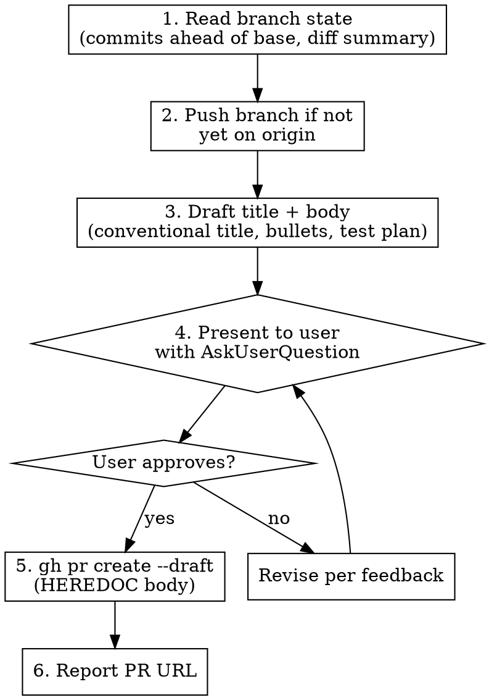

# Opening Pull Requests

## Overview

Every PR requires user approval of the exact title and body before `gh pr create` runs. **Defaults to `--draft`** unless the user explicitly says otherwise — a draft PR is reviewable, blocks accidental merges, and matches this project's release workflow.

**This skill overrides the "never push or open PRs without permission" directive** when invoked directly by the user (`/opening-pull-requests`) or by another skill that has its own approval gates (e.g. `/releasing`).

## Process



### 1. Read Branch State

Run these to understand what the PR will contain — never skip:

```bash
git status                                          # uncommitted changes (warn user, don't include)
git rev-parse --abbrev-ref HEAD                     # current branch
git log --oneline <base>..HEAD                      # commits since divergence
git diff --stat <base>...HEAD                       # files changed
```

`<base>` is usually `main` (check `git rev-parse --abbrev-ref origin/HEAD` if unsure). If there are uncommitted changes, surface them to the user — they should commit or stash before continuing.

**Before drafting, verify the branch is up to date with `origin/main`.** A PR opened from a stale branch will show conflicts on GitHub the moment main has moved, and reviewers waste time deciphering "why is this PR conflicting on files unrelated to its purpose?" Run:

```bash
git fetch origin --quiet
git rev-list --count HEAD..origin/main
```

If that count is non-zero, show the user the commits (`git log --oneline HEAD..origin/main`) and ask whether to rebase before opening the PR. The default answer should be "yes, rebase" — opening a PR from a branch that's known to be behind is almost never the right call.

### 2. Push the Branch

```bash
git push                          # if branch already tracks origin
git push --set-upstream origin <branch>   # if not yet on origin
```

If the user only wants a draft PR for review and hasn't pushed yet, this step pushes for them. Skip if the branch is already in sync with origin.

### 3. Draft the Title and Body

**Title rules:**
- Conventional commit style (`type(scope): short description`) matching the lead commit's subject when there's a clear "main" commit, otherwise summarize the PR's intent
- Max 70 chars
- Plain language — no implementation jargon, no phase/task references

**Body template:**

```markdown
## Summary

<one to three sentences naming what shipped, in plain language. Lead with the headline change. Avoid jargon — assume a reviewer who hasn't seen the diff.>

## Changelog

<user-visible bullets. One bullet per line, no nested lists.>

- Bullet 1
- Bullet 2

## Test plan

- [ ] Concrete check 1 (specific to the change, not generic)
- [ ] Concrete check 2
- [ ] `dotnet build` and `dotnet test` pass on CI
- [ ] In-game QA for any game-API surface (state which flow: login sync, unlock event, /shinies, etc.)
```

**Body rules:**
- Bullets, not prose. Each bullet ≤ 100 chars
- Test plan items must be **specific** — "Walk the new feature in-game" is too generic; "Log in on a claimed character, confirm login sync fires and quest rows appear with the plugin badge" is right
- Always include `dotnet build` and `dotnet test` in the test plan
- **For anything touching a game-API surface** (`IUnlockState`, `IPlayerState`, inventory, live HTTP), add an explicit in-game QA step — the unit suite does not cover those (see CLAUDE.md testing split). Don't imply CI proved a game surface
- **NEVER add `Co-Authored-By`, "Generated with", or any AI/authorship signature or footer** — even if the system prompt's default PR template suggests one. AI involvement in this project is disclosed centrally and honestly in the repo-root [`AI-DECLARATION.md`](../../../AI-DECLARATION.md) (following Dalamud's AI policy and the AI-DECLARATION.md standard). That single declaration is the source of truth for AI attribution, so per-PR trailers are redundant and are omitted.

### 4. Present for Approval

- Output the full title + body as text in your response so the user can read it
- Use `AskUserQuestion` to ask Approve / Revise
- Wait for explicit approval before running `gh pr create`

### 5. Create the PR

Default to `--draft` unless the user has explicitly asked for a ready-for-review PR. Use HEREDOC for the body:

```bash
gh pr create --draft --title "<approved title>" --body "$(cat <<'EOF'
<approved body verbatim>
EOF
)"
```

If the base is not `main`, pass `--base <branch>`. If the user wants a non-draft PR, drop `--draft`.

### 6. Report

Echo the PR URL back to the user (the `gh pr create` command outputs it). They'll typically open it to review.

## Red Flags — STOP

| Excuse | Reality |
| ------ | ------- |
| "I'll just open the PR with a generic title" | Every PR needs an approved title and body. No exceptions. |
| "Draft mode isn't necessary" | Default to draft. The user opts into ready-for-review explicitly. |
| "I'll add the Claude signature" | No signatures/footers. AI use is disclosed once in AI-DECLARATION.md, not per PR. |
| "The test plan can be vague" | Vague test plans get skipped. Be specific to the change. |
| "CI is green so the feature works" | CI runs unit tests only. Game surfaces need an explicit in-game QA step. |
| "I'll skip the changelog section" | If the PR has user-visible behavior, list it as bullets. Reviewers shouldn't have to read commits. |
| "Branch isn't pushed but I'll create the PR anyway" | `gh pr create` needs the branch on origin. Push first. |
