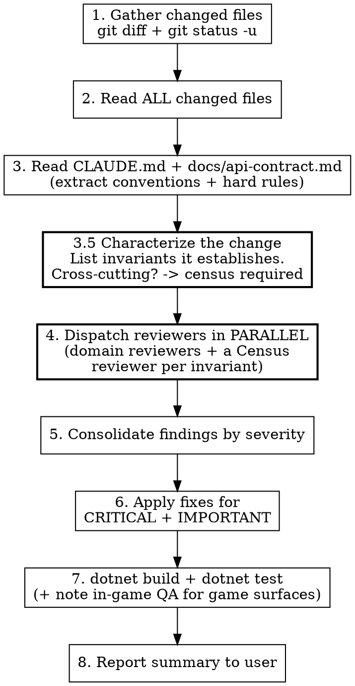

# Reviewing Code Changes

## Overview

Dispatch parallel subagent reviewers, consolidate findings by severity, apply fixes, verify.
Reviewers cover four dimensions tuned to this repo: **C# correctness + API-contract
conformance**, **Dalamud compliance + safety**, **comments/conventions/tests**, and a
**completeness census** for any cross-cutting invariant.

**The diff is the entry point, not the boundary.** The most dangerous defects in a changeset
are not in the lines that changed — they are in the lines that _should_ have changed and
didn't (a new `AddHandler` with no matching `RemoveHandler` in `Dispose`; a new collector that
introduces a category-name branch; a new HTTP call left on the framework thread). A diff-only
review is structurally blind to those. Reviewers here **can and must read and grep the whole
repository**, not just the files handed to them. For any change that establishes an
**invariant applied across many sites** (a cross-cutting change), a **completeness census** is
mandatory: enumerate _every_ site subject to the invariant and verify each — including sites
that don't appear in the diff.

## When to Use

- User asks to review changes, audit a branch, or check quality
- After completing a feature or fix, as a quality gate before committing
- When you want a second opinion on code you just wrote

**Not for:** reviewing PRs from others (use `gh pr view`), or reviewing a single tiny file
(just read it). Config/docs-only changes: skip this skill and review directly.

## Process



### 1-3. Gather Context

```bash
git diff --name-only              # modified tracked files
git status -u --short             # includes untracked new files
git diff --cached --name-only     # staged files (if any)
```

Read **every** changed/new file in full. Read `CLAUDE.md` (project conventions + the
**"Dalamud compliance"** section = the hard rules) and, for anything touching the wire
format, `docs/api-contract.md` (the server contract — the source of truth for DTOs).

Include file contents in reviewer prompts as a convenience — but **do not treat the diff as
the boundary.** Subagent reviewers (`general-purpose`) have their own Read/Grep/Glob tools;
tell them to use them and explore callers, siblings, and the wider repo.

> **Never leave a `<<DIFF>>`-style placeholder unsubstituted.** Fill every placeholder, or
> tell the reviewer to pull `git diff` and the surrounding code themselves.

### 3.5. Characterize the Change — and Census Any Cross-Cutting Invariant

Write down (for yourself) **what invariants this change establishes or depends on.** Common
ones in this repo:

- "every `CommandManager.AddHandler` has a matching `RemoveHandler` in `Dispose()`"
- "every event `+=` / `UiBuilder` callback / `WindowSystem` registration is torn down in `Dispose()`"
- "the orchestrator and settings UI contain **zero category-name branches** (extensibility contract) — every collector flows through the generic path"
- "every DTO field matches `docs/api-contract.md` exactly (name, casing, constraints)"
- "every `/config` kill switch is honored client-side before collecting/uploading"
- "game state is read on the framework thread; HTTP runs off it"

For each: is it **localized** (one/few sites, all in the diff) or **cross-cutting** (must hold
at _every_ site of a pattern)? Cross-cutting → run a **Census** (a dedicated reviewer, or do it
yourself first): grep the **whole repo** for every site of the pattern, then **classify each**
(does the invariant apply? is it satisfied?). The deliverable is a table of *every* site with a
✓/✗ — not a sample. Grep for the _concept_, not just the old code — a site that never had the
pattern (a new window that forgot to register cleanup) won't match a search for the old code
yet may still need the rule.

### 4. Dispatch Reviewers in Parallel

Use the `Agent` tool with `subagent_type: general-purpose`, all in a **single message** so
they run in parallel. Dispatch the relevant domain reviewers below **plus one Census reviewer
per cross-cutting invariant**.

Each reviewer gets: the **starting files** (contents inline) **and** explicit license to
read/grep the wider repo; the **relevant CLAUDE.md excerpts** (especially the Dalamud
compliance rules); and a **structured output format** (Strengths, Issues by severity, Verdict).

**Model:** use `opus` for reviewers — they need judgment and broad understanding.

#### Reviewer 0: Completeness / Census (one per cross-cutting invariant)

**Mandate:** prove the invariant holds at EVERY site, or list where it doesn't.

```text
You are a completeness auditor. A change establishes this invariant:
  "[state it precisely, e.g. 'every CommandManager.AddHandler has a matching
   RemoveHandler in Dispose()']"

Your job is NOT to review the diff. Find EVERY site in the repo subject to this
invariant and verify each — especially sites the diff did NOT touch.

1. Enumerate every site of the pattern with Grep/Glob (grep the CONCEPT, not just
   the old code being replaced).
2. For each site, output a row: file:line | does the invariant apply? | satisfied? | evidence
3. List every site where it applies but is NOT satisfied as an Issue.

Output: the full census table (every site, no sampling) + Issues by severity.
```

#### Reviewer 1: C# Correctness & API-contract conformance

**Files:** logic `*.cs` — DTOs, `ApiClient`, `SyncManager`, collectors, `PluginMeta`, `Configuration`.

**Focus:**
- Correctness: logic bugs, edge cases, off-by-one, **null handling** (nullable reference types), collection/enumeration mistakes.
- Async: no sync-over-async (`.Result`/`.Wait()`), correct `await`, cancellation, HTTP error/timeout handling.
- **Contract conformance:** every request/response DTO matches `docs/api-contract.md` **exactly** — field names, JSON casing, types, constraints (e.g. `characterContentIdHash` is 64 lowercase hex; id lists are positive ints; `items` shape). Status-code handling matches the contract (401 stop, 403 claim-hint, 413/429/503 backoff, 5xx retry).
- **Monotonic writes:** omit an unreadable category (don't send an empty array); never treat absence as "cleared".
- Exceptions: no swallowed errors that hide failures; no crashes that would take down the game.

#### Reviewer 2: Dalamud compliance & safety

**This is the load-bearing reviewer for approval.** Validate the change against the hard rules
in CLAUDE.md's **"Dalamud compliance"** section. Enumerate each rule and mark applicable/verified:

- **Local player only** — grep for `ObjectTable`, party/alliance enumeration, any non-local `ContentId`. Only `IPlayerState` / `ClientState.LocalContentId` is allowed. Any other-player read is **CRITICAL**.
- **ContentId hashed client-side** — SHA-256 before it leaves the process; raw ulong never sent, never logged, never persisted. Digest deterministic across sessions.
- **Network:** HTTPS only, DNS hostname (never a raw IP), backend URL user-overridable, `User-Agent: XIVShinies.SyncPlugin/<version>` present.
- **Explicit opt-in before any upload** — no silent first-run upload, no background polling without user action; disclose what is sent.
- **No plugin-usage fingerprinting** — analytics id pseudo-random/absent, resettable; nothing that lets a third party detect plugin usage.
- **Framework thread** — game state read on the framework thread; HTTP and heavy work OFF it; **no `.Result`/`.Wait()` on a framework-thread task** (deadlocks the game); marshal via `IFramework.RunOnFrameworkThread`/`RunOnTick`.
- **Full teardown** — every `AddHandler`, event `+=`, `UiBuilder` callback, and `WindowSystem` window added in the constructor is removed in `Dispose()`. (Census-worthy.)
- **Windowing API + no unprompted windows** — windows open only from `/shinies`, the installer buttons, or the first-run wizard; use `WindowSystem`.
- **Reproducible from public source** — no obfuscation, no downloading/loading external code or native binaries at runtime, no self-update, no timestamp/auto-increment version.

Treat any violation of a hard rule as **CRITICAL** — these gate official-repo approval and some are ban-enforced.

#### Reviewer 3: Comments, conventions & test coverage

**Comments (a baked-in requirement of this repo — CLAUDE.md rule 2):**
- Every new non-trivial construct is commented for a **beginner AND a contributor** — what it *is*, why it's here, what the C#/Dalamud syntax means. Under-commented new code is an **IMPORTANT** finding here, not a nit.
- Comments are **accurate, professional, durable** — no "note to self" phrasing, and **no transient/implementation references** (task/phase numbers, private-repo paths, `[Design DN]` tags) in committed comments or shipped strings.
- New C# concepts a React dev wouldn't know are explained (a brief plain-language note; React analogies are welcome but optional in code comments).
- If the change is substantial, confirm a **learning summary** was produced per the `/learning-summary` skill.

**Conventions:**
- `ImplicitUsings` off → explicit `using`s; file-scoped namespaces; `using`s outside the namespace; `System.*` first.
- ImGui is `Dalamud.Bindings.ImGui` (not `ImGuiNET`).
- `.editorconfig` naming holds (private fields camelCase, etc.); build stays **warning-clean**.

**Tests (be honest about the split — CLAUDE.md testing philosophy):**
- **Pure logic** (DTO round-trips, auth state machine, diffing, debounce/interval scheduling with an abstracted clock, kill-switch precedence, armoire bit→item mapping) **must have xUnit tests** in `PluginMeta`-style Dalamud-free classes.
- **Game-API surfaces** (`IUnlockState`, `IPlayerState`, `IDataManager`, `InventoryManager`, `ItemFinderModule`, live HTTP) are correctly left to **in-game QA** — flag any attempt to fake a unit test around a live game service, and flag game-touching logic that _could_ have been extracted into a pure, testable helper but wasn't.
- If collectors changed, confirm the **extensibility-gate test** (a fake registered collector flows through payload assembly + settings enumeration with zero category-name branches) still holds.

**Every reviewer's output format:**

```text
**Strengths:** (list)
**Issues:** (Severity: CRITICAL / IMPORTANT / MINOR, File + line, Description, Suggested fix)
If no issues: "No issues found."
```

### 5. Consolidate Findings

Build one table:

| # | Severity | Source | Issue | Action |
|---|----------|--------|-------|--------|
| 1 | CRITICAL | Dalamud | Description | **Fix** |

**Action rules:**
- **CRITICAL** — always fix. **Every Dalamud hard-rule violation is CRITICAL** (rejection/ban risk), plus correctness bugs, contract mismatches, crashes, data-safety issues.
- **IMPORTANT** — fix unless it needs architecture changes outside this changeset. Includes **missing/inadequate comments** (a project requirement here), missing pure-logic tests, framework-thread risk, incomplete teardown.
- **MINOR** — fix if trivial (naming, a clarifying comment, unused using). Otherwise note.
- **"Pre-existing" is NEVER a reason to skip a fix.** If a finding reveals a real bug/inconsistency, fix it — and if the same pattern exists elsewhere, fix **every** instance. The only valid skips: a false positive, or a genuinely large architectural change to surface to the user first (ask, don't silently skip).
- **Duplicate findings:** merge — multiple reviewers flagging the same issue strengthens priority.

### 6. Apply Fixes

Make targeted changes directly. Keep the heavy-commenting standard on any code you add or change.

### 7. Verify

```bash
dotnet build   # Release; must be WARNING-CLEAN (0 warnings, 0 errors)
dotnet test    # full xUnit suite — a fix can break a distant test
```

All must pass clean; re-run until green. A fix that causes a new failure is a new CRITICAL —
resolve before reporting.

**In-game QA is part of verification for game-touching changes.** The xUnit suite cannot
exercise Dalamud services or live HTTP. If the change touches a game surface, **say so
explicitly** and list the in-game QA steps needed — do NOT imply the build/test run proved it.

**When a Census ran, verification isn't done until the census table is complete** — every site
classified ✓, zero un-reviewed sites. "We fixed the ones we found" ≠ "we found them all";
re-grep to confirm no site of the pattern remains unhandled.

### 8. Report

Show the user: the consolidated findings table; which fixes were applied; which items were
deferred and why; the `dotnet build` + `dotnet test` results; and any in-game QA still required.
If every reviewer found nothing, "All reviewers passed with no findings" is a valid outcome.

## Adapting Reviewer Focus

| Changes are... | Dispatch |
|----------------|----------|
| Pure logic (DTOs, scheduling, mapping, state machine) | C# Correctness + Comments/Conventions/Tests |
| Touches game services / HTTP / lifecycle | **Dalamud Compliance** + C# Correctness (+ Census for teardown) |
| New/changed collector | Census (no category-name branches; extensibility gate) + C# Correctness |
| UI window | Dalamud Compliance (windowing, no unprompted open, teardown) + Comments |
| **Cross-cutting invariant** (teardown symmetry, contract field parity, kill-switch honoring) | **Census (one per invariant)** + relevant domain reviewers — the census is the main event |
| Config/docs only | Skip this skill — review directly |

## Common Mistakes

| Mistake | Fix |
|---------|-----|
| Reviewing only the diff for a cross-cutting change | The defects are in the sites NOT in the diff (a missed `RemoveHandler`, a new category-name branch). Run a Census. |
| Grepping only for the old pattern | A brand-new site (a window that forgot cleanup) won't match. Grep the concept; enumerate all sites. |
| Census by sampling | Every site gets a ✓/✗. One un-classified site is a hole. |
| Treating a Dalamud hard-rule miss as minor | It's CRITICAL — it can get the plugin rejected or banned. |
| Letting new code ship under-commented | Heavy beginner+contributor comments are a project requirement — flag as IMPORTANT. |
| Faking a unit test around a live game service | Game surfaces get in-game QA, not fake unit tests. Extract pure logic and test that instead. |
| Claiming a game-touching change is "verified" by build/test | The suite can't run game services. Call out the required in-game QA explicitly. |
| Skipping a finding because it's "pre-existing" | Never an excuse — fix the real issue and every instance of the pattern. |
| Sequential reviewer dispatch | One message, multiple `Agent` calls, so they run in parallel. |
