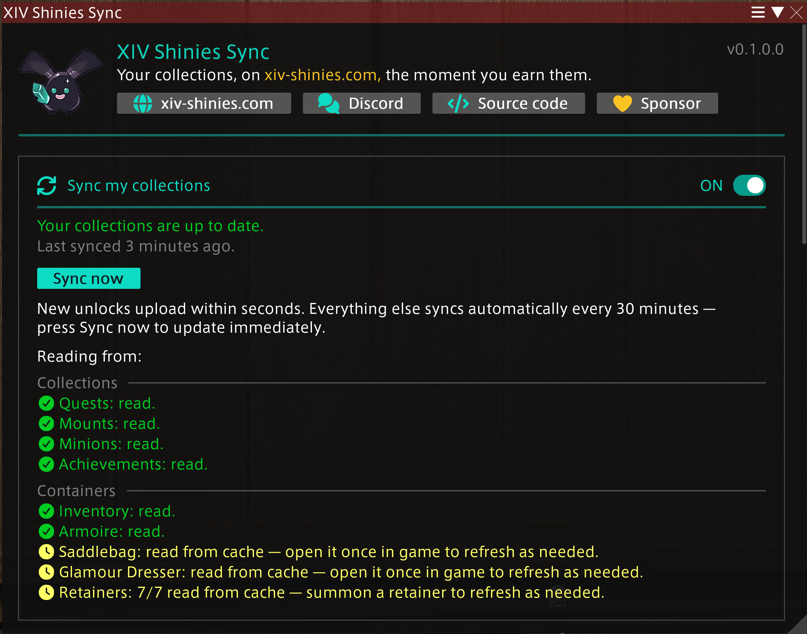
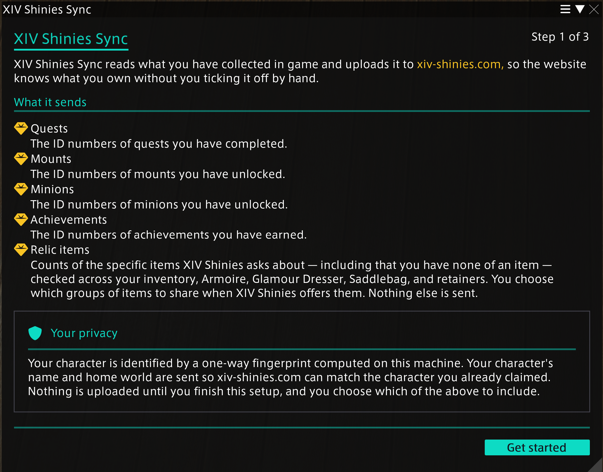
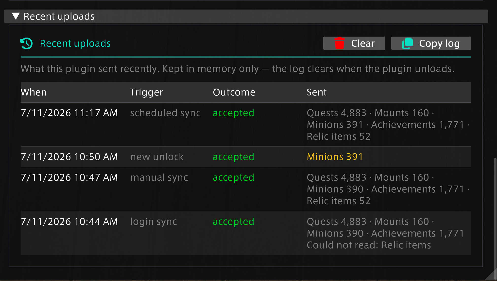

<div align="center">
  
  <h1>XIV Shinies Sync</h1>
  <p><em>Your collections, on <a href="https://xiv-shinies.com">xiv-shinies.com</a>, the moment you earn them.</em></p>
  <p>
    <a href="https://xiv-shinies.com">🌐 xiv-shinies.com</a>
    &nbsp;·&nbsp;
    <a href="https://discord.gg/UuNe5BwAGG">💬 Discord</a>
    &nbsp;·&nbsp;
    <a href="https://www.patreon.com/c/noranda/">💛 Sponsor</a>
  </p>
</div>

A [Dalamud](https://github.com/goatcorp/Dalamud) plugin for Final Fantasy XIV that
automatically records your collection progress on [XIV Shinies](https://xiv-shinies.com).
New unlocks — quests, achievements, mounts, minions, and more — appear on the site within
seconds, and everything else syncs automatically in the background, so you stop hand-marking
what you already earned.

> **Status:** feature-complete and in final pre-release testing. The first tagged release and
> the install repository are coming soon; until then, developers can build and load it locally
> (see [CONTRIBUTING.md](CONTRIBUTING.md)).



## How it works

The plugin reads completion facts directly from your own game client and uploads them over
HTTPS to XIV Shinies, which does all the derivation server-side. A plugin upload is
first-party evidence from inside the game client, so it verifies character ownership and
outranks a Lodestone scrape. The plugin itself is deliberately a **dumb fact-reader**: it
sends only raw facts the game knows and never computes site concepts like relic steps — which
keeps it stable as the site grows new collections and rules.

New unlocks (quests, achievements, mounts, minions) upload within seconds of earning them.
Item possession — used to prove relic progress — travels with periodic full syncs, or
immediately with the **Sync now** button.

## What gets sent

Only your **own local character's** collection facts, and only for the categories you opt
into:

- Completed **quest** IDs
- Unlocked **achievement**, **mount**, and **minion** IDs
- **Possession counts** for the specific relic-stage items the server asks about — checked
  across your inventory, armoire, glamour dresser, saddlebag, and retainers

Your character is identified by a **one-way fingerprint computed on your machine** — the raw
ContentId never leaves the game process, and never lands in logs or config. Your character's
name and home world are sent so the site can match the character you already claimed. Nothing
about other players is ever read or sent.

The exact wire format is documented in [`docs/api-contract.md`](docs/api-contract.md); the
deployed XIV Shinies server is its authority. How each Dalamud rule is satisfied is documented
rule-by-rule in [`docs/dalamud-compliance.md`](docs/dalamud-compliance.md).

## Fully opt-in

Nothing uploads until you finish a short first-run setup that shows exactly what each
collection sends and asks you to switch categories on explicitly. Every category — and syncing
as a whole — can be toggled at any time from the settings window (`/shinies`).



## See exactly what was sent

The settings window keeps a **Recent uploads** log: every upload's time, trigger, outcome, and
per-category counts, with changes since the previous upload highlighted. **Copy log** puts a
plain-text version on your clipboard for bug reports — it carries counts, outcomes, and
failure diagnostics only, never IDs or character identity. The log lives in memory and clears
when the plugin unloads.



## Installing

### From the plugin repository (once released)

1. In-game, open `/xlsettings` → **Experimental**.
2. Add this URL under **Custom Plugin Repositories**:

   ```
   https://raw.githubusercontent.com/noranda/xiv-shinies-plugin/main/repo.json
   ```

3. Save, then install **XIV Shinies Sync** from `/xlplugins`.

_(The `repo.json` pluginmaster and tagged release zips are the current work in progress.)_

### For development

See [CONTRIBUTING.md](CONTRIBUTING.md) for prerequisites, building, loading the dev plugin
in-game, and the project's testing philosophy.

## Contributing, security, and AI disclosure

- **Contributions** are welcome — read [CONTRIBUTING.md](CONTRIBUTING.md) first; this project
  follows [Dalamud's plugin guidelines](https://dalamud.dev/plugin-publishing/restrictions/)
  strictly, and PRs are reviewed against them.
- **Security issues**: see [SECURITY.md](SECURITY.md) — please report privately.
- **AI involvement** in this codebase is disclosed centrally in
  [AI-DECLARATION.md](AI-DECLARATION.md). The plugin icon and all shipped imagery are
  hand-made.

## License

[MIT](LICENSE) © Noranda
